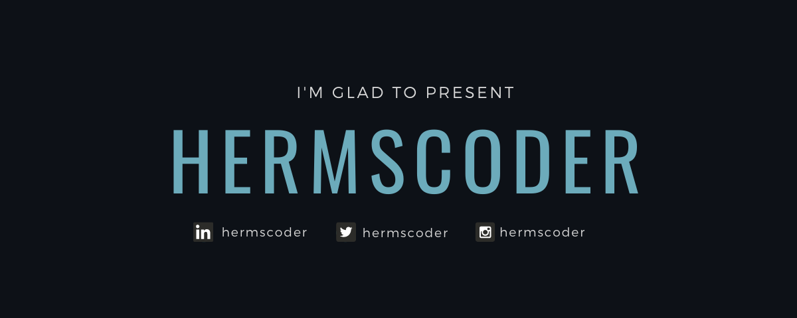

### Hi there 👋

**Hermscoder** is an ✨ _extraordinary developer_ ✨
Always looking for new challenges and projects that can motivate me to lear new concepts.

I love giraffes, and one of the reasons for it is the fact that:

_Giraffes are the only vertebrate animal that doesn't **yawn**_.

Meaning that even when tired, they always show great resilience! 🦒

### 🤝 Connect with me:

    
     

### 🔭 I’m currently working on
- 🎨 Building a game without any libraries in Java
- 🏗️ Backend of a micro-services application for finding roommates. (On hold)

### 🌱 I’m currently learning ...
- 🎨 Studying more about Kotlin, and Java and developing microservices with Spring

### 💼 Technical Skills 

### 📈 Github Stats

